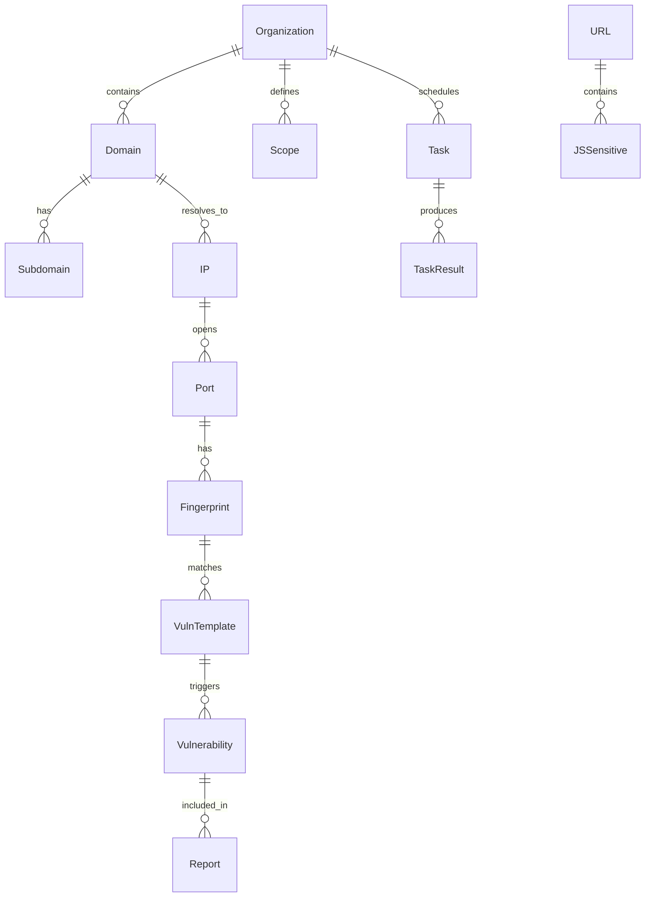

# 🚀 Sky-Eye 资产挖掘与打点系统 — 架构设计

## 一、设计目标

> 构建一款**模块化、可扩展、自动化**的资产挖掘与打点系统，辅助 SRC 漏洞挖掘全流程。

| 目标 | 说明 |
|------|------|
| **全链路覆盖** | 从目标域名到漏洞报告的完整 Pipeline |
| **模块化解耦** | 每个模块可独立运行，也可编排成工作流 |
| **资产持久化** | 所有资产存入数据库，支持历史追踪和变化监控 |
| **SRC 友好** | 漏洞报告格式直接适配补天/漏洞盒子/SRC 要求 |
| **插件生态** | 指纹、POC 均支持热加载扩展 |

---

## 二、整体架构

```
┌─────────────────────────────────────────────────────────────────┐
│                         Web UI (Vue3)                           │
│               Dashboard / 任务管理 / 资产可视化 / 报告预览        │
└──────────────────────────┬──────────────────────────────────────┘
                           │ REST API (FastAPI)
┌──────────────────────────▼──────────────────────────────────────┐
│                     API 网关层 (Nginx/FastAPI)                    │
│              认证 / 授权 / 限流 / 任务队列调度                     │
└──────────────────────────┬──────────────────────────────────────┘
                           │
┌──────────────────────────▼──────────────────────────────────────┐
│                      核心调度引擎 (Core Engine)                    │
│            Pipeline Orchestrator / 工作流编排 / 结果聚合           │
└──────┬──────────┬──────────┬──────────┬──────────┬──────────────┘
       │          │          │          │          │
┌──────▼──┐ ┌─────▼─────┐ ┌─▼────────┐ ┌─▼────────┐ ┌─▼──────────┐
│  信息收集 │ │  指纹识别  │ │ 漏洞检测  │ │  打点利用  │ │  报告生成  │
│  Recon   │ │ Fingerprint│ │ VulnScan │ │  Exploit  │ │  Report    │
└──────┬──┘ └─────┬─────┘ └─┬────────┘ └─┬────────┘ └─┬──────────┘
       │          │          │            │            │
┌──────▼──────────▼──────────▼────────────▼────────────▼──────────┐
│                        数据持久层 (Data Layer)                    │
│            SQLite (起步) → PostgreSQL (后续)                       │
│              资产库 / 漏洞库 / POC库 / 指纹库 / 任务库              │
└──────────────────────────────────────────────────────────────────┘
```

---

## 三、模块详细设计

### 3.1 信息收集模块 (Recon)

```
┌─────────────────────────────────────────────────────────────────┐
│                       Recon Module                               │
├─────────────────────────────────────────────────────────────────┤
│ 子域名收集 ────┬── 被动枚举 (Subfinder)                          │
│                ├── DNS 爆破 (ksubdomain)                         │
│                ├── 证书透明度 (crt.sh)                            │
│                └── 搜索引擎/第三方API                              │
├─────────────────────────────────────────────────────────────────┤
│ IP/ASN 发现 ───┬── DNS 解析 → A 记录                             │
│                ├── ASN 查询 → IP 段                               │
│                ├── CDN 识别 → 真实 IP 穿透                        │
│                └── ICP 备案 → 同主体站点                           │
├─────────────────────────────────────────────────────────────────┤
│ 端口扫描 ──────┬── TCP 快速扫描 (masscan/nmap)                   │
│                ├── 服务识别 (fingerprint)                         │
│                └── Web 存活检测 (httpx)                           │
├─────────────────────────────────────────────────────────────────┤
│ JS 提取分析 ───┬── JS URL 提取 (linkfinder)                      │
│                ├── 敏感信息正则 (key/secret/内网IP)               │
│                └── API 端点发现                                   │
├─────────────────────────────────────────────────────────────────┤
│ 空间搜索引擎 ───┬── Fofa / Hunter / Quake / Shodan               │
│                └── 结果回填至资产库                               │
└─────────────────────────────────────────────────────────────────┘
```

**核心输出：**
- `Domain`: 域名及其子域名清单
- `IP`: 解析到的 IP 地址、C 段、ASN
- `URL`: 存活 URL、API 端点
- `JSSensitive`: JS 中提取的敏感信息

---

### 3.2 指纹识别模块 (Fingerprint)

```
┌─────────────────────────────────────────────────────────────────┐
│                   Fingerprint Module                             │
├─────────────────────────────────────────────────────────────────┤
│ 指纹匹配引擎 ──┬── HTTP 响应头匹配                               │
│                ├── HTML/JS 内容匹配 (正则/XPath)                  │
│                ├── Favicon Hash 匹配 (mmh3)                      │
│                ├── URL 路由特征匹配                               │
│                └── 错误页面特征匹配                                │
├─────────────────────────────────────────────────────────────────┤
│ 指纹库 ────────┬── 内置 3000+ 指纹 (对接 FingerprintHub)         │
│                ├── 自定义指纹 (YAML 热加载)                       │
│                └── 社区指纹订阅 (自动更新)                        │
├─────────────────────────────────────────────────────────────────┤
│ 识别对象 ──────┬── CMS/建站系统 (织梦/帝国/WordPress/Discuz)     │
│                ├── OA 办公系统 (致远/泛微/蓝凌/通达/用友/金蝶)   │
│                ├── 开发框架 (Spring/ThinkPHP/Laravel/Shiro)      │
│                ├── 中间件 (Tomcat/Nginx/Jenkins/Nacos/Redis/ES)  │
│                ├── 安全设备 (深信服/华为/H3C/天融信/绿盟)        │
│                └── WAF 识别 (Cloudflare/阿里云/腾讯云/安全狗)    │
└─────────────────────────────────────────────────────────────────┘
```

**核心输出：**
- `Fingerprint`: 每个资产的技术栈标签
- `Category`: 资产分类 (OA/CMS/框架/中间件/设备)
- `Confidence`: 匹配置信度
- `MatchedRule`: 匹配到的具体规则

---

### 3.3 漏洞检测模块 (VulnScan)

```
┌─────────────────────────────────────────────────────────────────┐
│                     VulnScan Module                              │
├─────────────────────────────────────────────────────────────────┤
│ POC 引擎 ──────┬── 兼容 Nuclei YAML 格式                        │
│                ├── 兼容 Xray POC 格式                            │
│                ├── 自定义 Python POC                             │
│                └── 免伤眼模式 (不发送危险 payload)                │
├─────────────────────────────────────────────────────────────────┤
│ 定向检测 ──────┬── 根据指纹自动匹配 POC                          │
│                ├── 不盲目全量扫描, 按资产类型精准检测            │
│                └── 示例: 发现致远OA → 自动打致远OA POC 包       │
├─────────────────────────────────────────────────────────────────┤
│ 弱口令检测 ────┬── 服务弱口令 (SSH/FTP/MySQL/Redis/Mongo)       │
│                ├── Web后台弱口令 (Tomcat/Jenkins/WordPress)      │
│                ├── 系统默认口令 (OA/设备/VPN 厂商默认)          │
│                └── 支持自定义字典                                │
├─────────────────────────────────────────────────────────────────┤
│ 未授权检测 ────┬── 常见未授权端点检查                            │
│                ├── Actuator / Swagger / API Docs                │
│                ├── Jenkins Script Console / Nacos 未授权        │
│                └── Redis/ES/MongoDB 空密码                      │
├─────────────────────────────────────────────────────────────────┤
│ 专项漏洞 ──────┬── Log4j JNDI 扫描                              │
│                ├── Shiro 反序列化 (key 检测 + 利用)             │
│                ├── Spring4Shell 检测                            │
│                ├── FastJSON 反序列化                             │
│                └── ThinkPHP RCE 系列                             │
└─────────────────────────────────────────────────────────────────┘
```

**POC 优先级策略 (按风险排序)：**
```
等级1 (严重): RCE、反序列化、命令执行 → 立即告警
等级2 (高危): SQL注入、文件上传、SSRF → 打出高亮
等级3 (中危): 未授权访问、信息泄露 → 记录备查
等级4 (低危): 弱口令 → 批量验证
```

---

### 3.4 打点利用模块 (Exploit)

```
┌─────────────────────────────────────────────────────────────────┐
│                     Exploit Module                               │
├─────────────────────────────────────────────────────────────────┤
│ 漏洞利用 ──────┬── 自动打印利用成功后的关键信息                  │
│                ├── RCE → 回显命令执行结果                         │
│                ├── 文件读取 → 读取关键配置文件                   │
│                └── SSRF → 探测内网并回填至资产库                  │
├─────────────────────────────────────────────────────────────────┤
│ 横向扩展 ──────┬── 边界突破后自动扫描内网存活                   │
│                ├── 云元数据 API 探测 (AWS/Aliyun/Tencent)        │
│                └── 内网 Redis/SSH 写公钥                         │
├─────────────────────────────────────────────────────────────────┤
│ Shell 管理 ────┬── 反弹 Shell 生成器                             │
│                ├── Webshell 管理                                 │
│                └── 隧道代理 (frp/ngrok 整合)                     │
└─────────────────────────────────────────────────────────────────┘
```

> ⚠️ **安全设计原则**：Exploit 模块默认**不启用**，需用户手动确认开启。所有利用行为记录详尽审计日志。

---

### 3.5 报告生成模块 (Report)

```
┌─────────────────────────────────────────────────────────────────┐
│                     Report Module                                │
├─────────────────────────────────────────────────────────────────┤
│ 报告格式 ──────┬── SRC 标准格式 (Markdown)                      │
│                ├── 补天/漏洞盒子/各大SRC 模板适配                │
│                └── PDF/HTML 导出                                 │
├─────────────────────────────────────────────────────────────────┤
│ 报告内容 ──────┬── 漏洞标题 + 类型 + 等级                        │
│                ├── 漏洞描述 + 影响版本                           │
│                ├── 复现步骤 (含 POC 截图)                       │
│                ├── 影响资产列表                                  │
│                └── 修复建议                                      │
└─────────────────────────────────────────────────────────────────┘
```

---

### 3.6 资产管理模块 (Asset Management)

```
┌─────────────────────────────────────────────────────────────────┐
│                   Asset Management Module                        │
├─────────────────────────────────────────────────────────────────┤
│ 目标管理 ──────┬── 组织/项目 层级管理                            │
│                ├── 标签系统 (分类/优先级/状态)                    │
│                └── Scope 范围定义 (允许/禁止测试范围)            │
├─────────────────────────────────────────────────────────────────┤
│ 资产追踪 ──────┬── 资产变更监控 (新子域名/新端口/新指纹)        │
│                ├── 历史数据对比 (按时间线展示变化)               │
│                └── 定时任务 (定期巡检)                           │
├─────────────────────────────────────────────────────────────────┤
│ 漏洞生命周期 ──┬── 待确认 → 已确认 → 已提交 → 已修复 → 已归档  │
│                ├── SRC 状态同步                                  │
│                └── 重复漏洞检测                                   │
└─────────────────────────────────────────────────────────────────┘
```

---

## 四、数据库模型设计



**核心表结构：**

| 表名 | 主要字段 | 说明 |
|------|---------|------|
| `organizations` | id, name, industry, icp, tags | 目标组织/公司 |
| `domains` | id, org_id, domain, source, first_seen | 主域名 |
| `subdomains` | id, domain_id, subdomain, ip, cname, status | 子域名 |
| `ips` | id, ip, asn, cidr, is_cdn, location | IP资产 |
| `ports` | id, ip_id, port, protocol, service, banner | 开放端口 |
| `urls` | id, url, status_code, title, content_type | 存活URL |
| `fingerprints` | id, asset_type, asset_id, tech, version, confidence | 指纹 |
| `js_sensitives` | id, url_id, type, content, source_url | JS敏感信息 |
| `vuln_templates` | id, name, type, severity, poc_content, reference | POC模板 |
| `vulnerabilities` | id, vuln_template_id, asset_id, evidence, status | 发现的漏洞 |
| `tasks` | id, org_id, type, status, config, created_at | 扫描任务 |
| `task_results` | id, task_id, module, output, raw_data | 任务结果 |
| `reports` | id, org_id, vuln_ids, format, content, generated_at | 报告 |

---

## 五、工作流 Pipeline

```
                       ┌──────────────────┐
                       │   创建目标任务    │
                       │   (输入域名/公司) │
                       └────────┬─────────┘
                                ▼
              ┌─────────────────────────────────┐
              │       Phase 1: 信息收集          │
              │  子域名 → IP → 端口 → URL → JS   │
              └───────────────┬─────────────────┘
                              ▼
              ┌─────────────────────────────────┐
              │       Phase 2: 指纹识别          │
              │    CMS/OA/框架/设备/中间件/WAF   │
              └───────────────┬─────────────────┘
                              ▼
              ┌─────────────────────────────────┐
              │       Phase 3: 漏洞检测          │
              │   POC匹配 → 定向扫描 → 弱口令   │
              └───────────────┬─────────────────┘
                              ▼
              ┌─────────────────────────────────┐
              │       Phase 4: 打点利用          │
              │   (手动确认后) RCE/SSRF/文件上传 │
              └───────────────┬─────────────────┘
                              ▼
              ┌─────────────────────────────────┐
              │       Phase 5: 报告生成          │
              │     SR C 格式 Markdown/PDF      │
              └─────────────────────────────────┘
```

---

## 六、技术栈选型（已确定 ✅）

| 层级 | 技术选型 | 理由 |
|------|---------|------|
| **后端语言** | Python 3.11+ | 安全工具生态丰富(POC/指纹/exp)，开发效率高 |
| **Web框架** | FastAPI | 异步高性能、自动 OpenAPI 文档、Pydantic 数据校验 |
| **ORM** | SQLAlchemy 2.0 + Alembic | 成熟稳定、支持异步、迁移方便 |
| **数据库** | SQLite (起步) → PostgreSQL (后续) | 单机轻量零配置，起步 SQLite 足够 |
| **前端** | Vue3 + Element Plus + Vite | 生态好、组件丰富、开发高效 |
| **任务队列** | 内置轻量队列 (起步) → Celery+Redis (后续) | 起步减少依赖，先跑起来再说 |
| **POC格式** | Nuclei YAML (首选) + Xray | 社区 POC 最丰富，可复用 5000+ POC |
| **指纹库** | FingerprintHub (YAML) | 3139+ 条指纹，社区活跃 |
| **容器化** | Docker + Docker Compose (后续) | 先保证核心功能可运行 |
| **API文档** | FastAPI 自动生成 OpenAPI | 前端开发直接对接 Swagger |

---

## 七、与现有工具的差异化优势

| 维度 | 现有工具 (ARL/水泽/Fscan) | Sky-Eye |
|------|--------------------------|---------|
| **全链路** | 偏重信息收集或偏重漏洞扫描 | 从信息收集→打点→报告一站式 |
| **POC精度** | 全量扫，容易触发WAF/封IP | 指纹驱动 → 精准POC，低噪音免伤眼 |
| **资产追踪** | 单次扫描无历史对比 | 资产变更追踪、定时巡检 |
| **SRC适配** | 通用扫描，不关注SRC | 内置 SRC 模板、Scope 管理、状态同步 |
| **国产深度** | 通用工具 | 深度覆盖国内OA/CMS/安全设备指纹+POC |
| **可扩展性** | 插件系统弱 | 插件化模块、YAML热加载 |
| **打点辅助** | 无 | 弱口令库、默认密码字典、利用辅助 |

---

## 八、目录结构规划

```
sky-eye/
├── backend/                    # 后端服务
│   ├── app/
│   │   ├── api/               # REST API 路由
│   │   ├── core/              # 核心：配置/认证/数据库
│   │   ├── models/            # SQLAlchemy 模型
│   │   ├── schemas/           # Pydantic 校验模型
│   │   ├── modules/           # 功能模块
│   │   │   ├── recon/         # 信息收集
│   │   │   ├── fingerprint/   # 指纹识别
│   │   │   ├── vulnscan/      # 漏洞检测
│   │   │   ├── exploit/       # 打点利用
│   │   │   └── report/        # 报告生成
│   │   └── tasks/             # Celery 任务定义
│   ├── migrations/            # Alembic 迁移
│   └── requirements.txt
├── frontend/                   # Vue3 前端
│   ├── src/
│   │   ├── views/             # 页面
│   │   ├── components/        # 组件
│   │   ├── api/               # API 调用
│   │   └── router/            # 路由
│   └── package.json
├── pocs/                       # POC 库 (Nuclei/YAML)
│   ├── oa/                    # OA 系统
│   ├── cms/                   # CMS 系统
│   ├── framework/             # 开发框架
│   ├── middleware/             # 中间件
│   └── device/               # 安全设备
├── fingerprints/              # 指纹库 (YAML)
├── dictionaries/              # 字典文件
│   ├── subdomains/            # 子域名字典
│   ├── passwords/             # 弱口令字典
│   └── dirs/                  # 目录爆破字典
├── reports/                    # 生成报告
├── docker-compose.yml
├── Dockerfile
└── ARCHITECTURE.md
```

---

## 九、开发路线图（已确定 ✅）

### 第一阶段：信息收集引擎（当前起步）

> 以 Recon 模块为核心，从信息收集切入，走通子域名→IP→端口→URL→JS 全链路

| 子模块 | 功能 | 状态 |
|--------|------|------|
| 子域名收集 | 被动枚举 + crt.sh + DNS 爆破 | 🔴 首发 |
| IP/ASN 发现 | DNS 解析 + CDN 识别 | 🔴 首发 |
| 端口扫描 | TCP 快速扫描 | 🔴 首发 |
| Web 存活 | HTTPX 式存活检测 + 截图 | 🔴 首发 |
| JS 提取 | URL 提取 + 敏感信息正则 | 🟡 跟进 |
| 空间测绘 | Fofa/Hunter API 集成 | 🟡 跟进 |
| 资产可视化 | Web UI 展示资产地图 | 🔴 同步开发 |

### 后续阶段

| 阶段 | 内容 | 预计 |
|------|------|------|
| **Phase 2** | 指纹识别 + FingerprintHub 对接 | V1.1 |
| **Phase 3** | POC 引擎 + 漏洞检测 | V1.2 |
| **Phase 4** | 弱口令 + 未授权检测 | V1.3 |
| **Phase 5** | 报告生成 + 打点辅助 | V2.0 |
